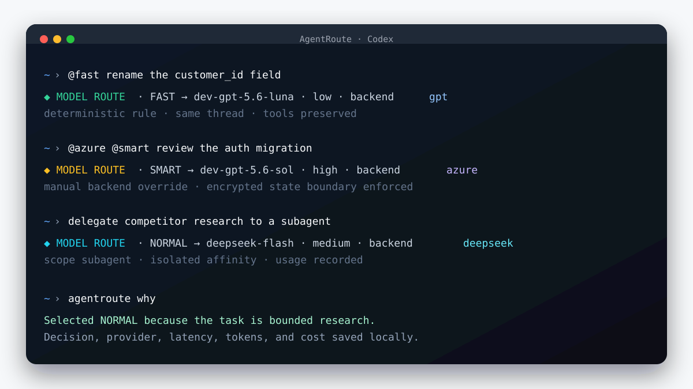

# AgentRoute

[](https://github.com/atiti/agent-router/actions/workflows/ci.yml)
[](https://github.com/atiti/agent-router/releases/latest)
[](LICENSE)
[](https://securityscorecards.dev/viewer/?uri=github.com/atiti/agent-router)

AgentRoute is a local-first, auditable model router for coding agents. It selects a model,
reasoning effort, and execution backend for every user turn while keeping the same Codex thread,
transcript, tools, and working context.

It is deliberately boring infrastructure: rules are inspectable, decisions are auditable, and
`@fast`, `@normal`, `@smart`, or `@max` always gives the human control. Prefix `@none`, `@minimal`,
`@low`, `@medium`, `@high`, `@xhigh`, `@ultra`, or `@persistent` to override the request reasoning
effort independently of the selected model tier and backend—for example, `@azure @ultra investigate
this incident`. An optional LLM classifier
can resolve ambiguous turns; it is disabled until explicitly configured.



```sh
curl -fsSL https://raw.githubusercontent.com/atiti/agent-router/main/scripts/bootstrap.sh | sh
source ~/.zshrc
agentroute doctor
codex
```

AgentRoute supports the interactive Codex CLI, `codex exec`, locally rebuilt Codex Desktop,
multiple ChatGPT subscription profiles, Azure OpenAI, and tool-compatible DeepSeek endpoints. See
[Install](#install) for prerequisites and the review-before-running flow.

> **Alpha:** Codex does not currently accept model overrides from `UserPromptSubmit` hooks. The
> installer builds a narrowly patched Codex from the pinned upstream commit documented below.
> This makes routing native to the active session instead of launching a new process per turn.

## How one turn is routed

```text
user prompt
    │
    ▼
Codex UserPromptSubmit hook ──► AgentRoute classifier ──► SQLite audit
    │                                  │
    │                    provider + model + reasoning effort
    ▼                                  │
the same active Codex thread ◄─────────┘
    │
    └── Stop hook ──► exact per-turn token counters ──► cost statistics
```

The native patch applies the chosen settings before the first model call of that turn. Explicit
read-only retrievals, mechanical edits, bounded replies/messages, and simple questions about existing context take a
deterministic high-confidence FAST lane; hard risk floors still win. Ambiguous decisions can be
sent to a small OpenAI-compatible classifier with a two-second timeout and immediate heuristic
fallback. A short
confirmation such as `ok do it` is never scored as a new tiny task: AgentRoute reads the previous
assistant final answer from Codex's local transcript and classifies that task definition. If the
transcript is unavailable, it inherits the previous selected tier.

Spawned subagents are routed independently. Their triggering task is classified by the same hook
before the child's first model call, and each audit row and route banner identifies whether the
decision belongs to the root agent or a subagent. A child starts with the parent's full or bounded
context according to Codex's spawn request and inherits the parent's effective provider by default.
A qualified explicit `model` can select another configured provider for one child:

```json
{
  "task_name": "policy_audit",
  "message": "Review the policy boundary and report only actionable findings.",
  "model": "agentroute-deepseek/deepseek-flash"
}
```

That qualified model changes only the new child and becomes affinity for that child's later
follow-ups; the parent and siblings keep their own providers. Invalid or unavailable qualified
destinations are blocked before the child calls a provider. For the initial child decision,
AgentRoute reuses
Codex's existing non-secret `task_name` as an internal routing hint. The actual delegated task
remains provider-encrypted, and all routing metadata is ephemeral: it is stripped before rollout
serialization and never appears in the child model's visible input. An opaque follow-up inherits
the exact child's most recent tier and backend, without borrowing state from the root or a sibling.
Child completion and token accounting use Codex's `SubagentStop` event and the child's own
transcript.

The classifier is a second-stage judge, not the primary router. Explicit overrides, approved agent
requests, high-confidence rules, and credential-shaped prompts never reach it. It returns the
cheapest sufficient tier, confidence, and task type; only the task type, confidence, and a hash of
its explanation are audited.

An agent that knows its current tier is insufficient can explicitly ask for the next turn's tier by
ending its final response with two visible plain-text lines:

```text
MODEL_REQUEST: SMART
MODEL_REQUEST_REASON: The production failure spans several services.
```

AgentRoute accepts the request only when the next user turn is an explicit confirmation such as
`ok`, `ok do it`, or `proceed`. Policy caps, risk floors, and Codex model-compatibility checks still
apply. The requested tier and a SHA-256 hash of the reason are audited; the reason text is not.

| Tier | Default Codex target | Typical work |
|---|---|---|
| FAST | `gpt-5.6-luna`, low | renames, formatting, mechanical edits |
| NORMAL | `gpt-5.6-terra`, medium | routine implementation |
| SMART | `gpt-5.6-sol`, high | debugging, security, complex changes |
| MAX | `gpt-6-astra`, high | architecture and high-risk cross-cutting work |

All mappings, thresholds, and risk floors are editable in `~/.agentroute/config.yaml`.

## Execution backends

The built-in `gpt` backend uses the existing ChatGPT subscription login. Azure OpenAI and
DeepSeek use API credentials from environment variables; AgentRoute never writes those secrets to
configuration or audit storage. Enable and map them with:

```sh
# Azure's URL includes /openai/v1; both Azure hostname forms are supported.
export AZURE_OPENAI_API_KEY="..."
agentroute backend-enable azure \
  --base-url https://YOUR-RESOURCE.openai.azure.com/openai/v1 \
  --fast-model YOUR_FAST_DEPLOYMENT \
  --normal-model YOUR_NORMAL_DEPLOYMENT \
  --smart-model YOUR_SMART_DEPLOYMENT \
  --max-model YOUR_MAX_DEPLOYMENT

# Some resources expose the equivalent hostname:
# https://YOUR-RESOURCE.cognitiveservices.azure.com/openai/v1

export DEEPSEEK_API_KEY="..."
agentroute backend-enable deepseek

agentroute backend-route fast deepseek
agentroute backend-route normal azure
# Or make one ready backend the default for every tier (for example, when a
# ChatGPT subscription has exhausted its current usage allowance):
agentroute backend-default azure
agentroute backend-status
```

For an OpenAI-compatible bearer-auth proxy in front of Azure, use its `/v1` base URL and add
`--api-key-header authorization`.

### Local and custom OpenAI-compatible backends

Add any endpoint that implements the OpenAI **Responses API** with `backend-add`. It is not
restricted to a provider allowlist. The backend name becomes both the route target and the prompt
prefix, so `ollama` is selected with `@ollama` inside Codex. Custom backends default to
`functions_and_apply_patch`: this deliberately keeps the admitted Codex safety authority while
only passing function calls and `apply_patch` to an unvalidated provider. Use `--tool-compatibility
full` only after validating the endpoint's tool behavior for your workload.

Ollama's local OpenAI-compatible endpoint needs no API key:

```sh
ollama pull qwen3-coder:30b
agentroute backend-add ollama \
  --base-url http://127.0.0.1:11434/v1 \
  --model qwen3-coder:30b \
  --display-name "Local Ollama"
agentroute backend-route fast ollama
```

Use `@ollama fix the lint error` to select it for one session, or `agentroute backend-default
ollama` to make it the default for every tier. An arbitrary authenticated gateway works the same
way; AgentRoute records only the environment-variable name, never the key:

```sh
agentroute backend-add private-gateway \
  --base-url https://models.example.com/v1 \
  --model fast-model \
  --smart-model reasoning-model \
  --api-key-env PRIVATE_GATEWAY_KEY
export PRIVATE_GATEWAY_KEY="..."
# Or persist it in AgentRoute's owner-only credential file:
agentroute backend-credential-import private-gateway PRIVATE_GATEWAY_KEY
```

`backend-add` requires a `/v1` base URL because Codex sends Responses API requests. A provider
that only implements Chat Completions is not compatible as an execution backend yet; it can still
be used for the classifier through `agentroute classifier-enable`.

For a persistent local test without putting a key in YAML or Codex TOML, import it from the
current process into AgentRoute's owner-only credential file, then unset the source variable:

```sh
agentroute backend-credential-import deepseek DEEPSEEK_API_KEY
unset DEEPSEEK_API_KEY
```

Backend mappings are defaults, not lock-in. Prefix a prompt with `@gpt`, `@azure`, or
`@deepseek`; combine it with a tier override in either order, such as
`@deepseek @smart review this design`. Disabled or unavailable configured backends visibly fall
back to `gpt`. An explicit backend becomes the root session preference, so contextual follow-ups
stay on the same backend and selected tier by default; use another backend prefix to switch or
`@auto` to return to automatic backend selection. Subagents keep independent preferences. Routing
prefixes are removed before the task is recorded or sent to the model.

`agentroute backend-default BACKEND` is the quota/failover control for future turns: it changes all
four tier defaults after verifying that the destination backend is enabled and credential-ready.
Run `codex` normally afterward. Provider prefixes are prompt syntax inside Codex—for example,
`@azure hello`—not shell commands such as `azure hello`. AgentRoute does not automatically replay a
failed provider request against a different provider because that could repeat a side effect or move
provider-bound state across a trust boundary.

Provider changes happen inside the active thread: Codex rebuilds only its
provider-specific request session while retaining the local conversation, tools, and turn state.
Once a thread has mixed providers, AgentRoute removes provider-bound
encrypted reasoning, compaction state, encrypted function arguments, and response item IDs while
preserving ordinary messages and portable tool-call history on every later provider request.
AgentRoute also applies a provider-declared tool compatibility profile. DeepSeek currently receives
ordinary function tools plus the `apply_patch` custom tool because its Responses API rejects
Codex's custom Code Mode `exec` tool. This changes only the wire format: the active Codex sandbox,
approval, Guardian, reviewer, and Node/Code Mode safety authority remains local and unchanged.
The same compatibility profile is applied when Codex starts an isolated automatic-review session,
so its existing read-only inspection tools are encoded as ordinary functions rather than an
unsupported custom `exec` tool.

Automatic approval review is routed independently from the worker tier. Each API backend defaults
to its FAST model at low reasoning effort, so a SMART or MAX worker does not make a bounded command
review unnecessarily expensive. The review stays on the same backend and credential boundary for
predictable availability and tool compatibility. Pin a separately validated reviewer when enabling
a backend with `--review-model MODEL`; `agentroute backend-status` shows the effective reviewer.
Guardian remains fail-closed and retains the same local policy, sandbox evidence, and authority
regardless of reviewer model.

## Capacity management and subscription failover

Capacity management is opt-in. It reads the ordinary ChatGPT subscription allowance already
polled by Codex's app-server, and uses locally audited token receipts to enforce optional
daily/monthly USD ceilings for API backends. It makes no extra provider request when you submit a
prompt. Account identifiers are reduced to a local 16-character hash in the audit database and are
never shown in a banner, config file, or report.

```sh
# Warn at 85%, move automatic routes away at 95%, and require 20% headroom before recovery.
agentroute capacity enable

# API ceilings use actual local receipt-derived API-equivalent cost, not a subscription invoice.
agentroute capacity budget azure --daily 20 --monthly 300
agentroute capacity budget deepseek --daily 10

# Choose the preference ring. A ring is allowed; each backend is tried once per turn.
agentroute capacity fallback gpt azure
agentroute capacity fallback azure deepseek
agentroute capacity fallback deepseek gpt

agentroute capacity status
agentroute analytics --days 30
```

When capacity is healthy the route banner includes `capacity healthy · subscription 62% used`.
At the warning threshold it says `CAPACITY WARNING` and includes the reset time when available.
For an automatic route AgentRoute can safely move the *next* turn to the next ready backend:

```text
CAPACITY FALLBACK: gpt capacity unavailable (…) · using azure
```

Provider-specific encrypted state is stripped on that boundary, while ordinary conversation and
portable tool history remain. AgentRoute never replays an in-flight provider request.

An explicit `@gpt`, `@azure`, or sticky session route is intentionally fail-closed when that
backend is exhausted or over budget. The banner and stop message explain the next action:

```text
CAPACITY BLOCKED: explicit session route gpt is capacity-locked. Use @auto to permit backend fallback.
```

### Multiple ChatGPT subscriptions, one Codex home

AgentRoute keeps the normal Codex state directory as the only `CODEX_HOME`. Sessions, `config.toml`,
hooks, MCP servers, skills, plugins, history, and rules therefore remain shared and resumable. The
stock `~/.codex/auth.json` is the implicit **default** account. Additional accounts contain only
credentials under `~/.codex/accounts/<name>/auth.json`.

```sh
# Your normal Codex login is already the default account.
agentroute account list

# Add a second subscription without creating another Codex setup.
agentroute account add work --select
agentroute account login work

# Keep MAX on Astra where this account supports it, and use Sol where it does not.
agentroute account model default max gpt-6-astra --reasoning-effort high
agentroute account model work max gpt-5.6-sol --reasoning-effort high

# Use an account for new threads. Existing threads preserve account affinity.
agentroute account use default
```

Selection happens inside the active `UserPromptSubmit` hook, not at Codex launch. When a
subscription is authoritatively exhausted, the next turn can continue the same thread using another
signed-in account:

```text
◆ ACCOUNT FAILOVER · work → default · current subscription exhausted · continuing this thread on the next turn
```

The transcript and thread remain in the canonical home. Provider-bound encrypted reasoning,
compaction state, encrypted function arguments, and response item IDs are discarded at an account
or provider boundary because another identity cannot decrypt them. Ordinary conversation and
portable tool history remain. AgentRoute never interrupts or replays an in-flight request, and
unknown quota telemetry never triggers an account switch. The chosen account stays sticky for later
turns until it is authoritatively exhausted or unavailable; subsequent banners show
`ACCOUNT ROUTE · <name> · session affinity`.

To migrate an old isolated home, copy only its file-backed credentials; its original directory is
left untouched as a rollback option:

```sh
agentroute account migrate work ~/.codex-work --select
```

If the old login is Keychain-backed rather than stored in `auth.json`, add the account and sign in
again with `agentroute account login work`. Do not copy configuration, sessions, skills, MCP
configuration, or hooks: the canonical `~/.codex` already owns them.

## Optional LLM classifier

For best routing quality, use a small cloud model only for ambiguous turns. This avoids maintaining
a local model runtime while deterministic turns remain sub-millisecond. AgentRoute requires a
dedicated environment variable and explicit permission before any bounded task context leaves the
machine:

```sh
export AGENTROUTE_CLASSIFIER_API_KEY="..."
agentroute classifier-enable --allow-remote \
  --endpoint https://api.openai.com/v1/chat/completions \
  --model gpt-5-mini
agentroute classifier-status
```

The key is never written to AgentRoute configuration or audit storage. It can also be read from an
owner-only file, which avoids requiring a long-lived shell environment variable. Verify the model
against the provider's `/v1/models` catalog after enabling it:

```sh
install -m 600 /private/path/classifier.key ~/.agentroute/classifier.key
agentroute classifier-enable --allow-remote \
  --endpoint https://models.example.com/v1/chat/completions \
  --model classifier-model \
  --api-key-file ~/.agentroute/classifier.key
agentroute classifier-verify
```

For a LiteLLM service exposed only on a private or Tailscale IP, HTTP requires a second, narrowly
scoped acknowledgement. Public HTTP endpoints remain rejected:

```sh
agentroute classifier-enable --allow-remote --allow-private-http \
  --endpoint http://100.64.0.10:4000/v1/chat/completions \
  --model dev-classifier \
  --api-key-file ~/.agentroute/classifier.key \
  --timeout 5 --reasoning-effort low
agentroute classifier-verify
```

To keep all classification local, point the same interface at an OpenAI-compatible loopback
endpoint such as Ollama; loopback HTTP is permitted without remote-egress flags:

```sh
agentroute classifier-enable \
  --endpoint http://127.0.0.1:11434/v1/chat/completions \
  --model qwen3:4b
```

Use `agentroute classifier-disable` to return to deterministic-only routing.

## Install

The recommended installer downloads the release for the current OS and CPU, verifies its SHA-256
checksum, and installs it under `~/.agentroute/`. It never replaces the official Codex binary.
`uv` and a working Codex login are the only prerequisites.

```sh
curl -fsSL https://raw.githubusercontent.com/atiti/agent-router/main/scripts/bootstrap.sh | sh
source ~/.zshrc  # use ~/.profile on non-zsh shells
agentroute doctor
codex
```

For a review-before-running flow, download `scripts/bootstrap.sh`, inspect it, and execute it with
`sh`. Every GitHub release includes per-platform checksums and GitHub build-provenance attestations.
Public macOS release jobs fail closed unless both binaries are Developer ID signed; the installer
also verifies the published checksum and executes the new runtime before committing an update.
Downloaded archives can also be independently checked with
`gh attestation verify ARCHIVE --repo atiti/agent-router`.

To update later:

```sh
agentroute update
```

### Build from source

Source builds require macOS or Linux, Git, Node/npm, `uv`, Rust/Cargo, a working Codex login, and
at least 6 GiB of free disk space.

```sh
git clone https://github.com/atiti/agent-router.git
cd agentroute
./scripts/install.sh
source ~/.zshrc
agentroute doctor
codex
```

Both installers place everything under `~/.agentroute/`, add `~/.agentroute/bin` to PATH, merge a
hook into `~/.codex/hooks.json` after making a backup, and expose:

- `codex`: patched Codex with native step model switching and Code Mode enabled
- `codex-code-mode-host`: a pinned official Codex package host from the same release lineage as the
  patched CLI, selected for wire-protocol compatibility instead of copying an arbitrary stock host
- `codex-stock`: the Codex binary that was active before installation
- `agentroute`: configuration, simulation, audit, and diagnostics CLI

It never replaces the original Codex binary. Set `AGENTROUTE_HOME` to choose another installation
root. `AGENTROUTE_CONFIG` and `AGENTROUTE_DATA_DIR` can override individual state paths.
During setup, AgentRoute asks the installed Codex app-server to calculate canonical hashes for the
two exact AgentRoute hook commands and records trust only for those entries. This makes the same
routing lifecycle work in the interactive TUI, Desktop, and headless `codex exec`; no global hook
trust bypass is enabled, and unrelated hooks retain their existing trust state.
The default local build uses Codex's stripped `dev-small` profile to limit disk use; set
`AGENTROUTE_BUILD_PROFILE=release` if you prefer an optimized build and have ample free space.
The installer pins the official Code Mode host package alongside the Codex source commit. Advanced
installations can provide a preverified executable with `AGENTROUTE_CODE_MODE_HOST`.

## Try it

```sh
agentroute test "Rename the account label"
agentroute test "Redesign authentication for a zero-downtime migration"
agentroute test "@deepseek @smart audit this concurrency design"
codex exec '@azure summarize the latest test result'
agentroute why
agentroute history
agentroute audit-report
agentroute stats --baseline gpt-6-astra
agentroute models
agentroute doctor
agentroute label 42 correct --notes "appropriate model for the completed task"
```

Use `agentroute observe` to audit decisions without changing models and `agentroute enable` to
resume native switching.

`agentroute stats` uses Codex's cumulative per-turn transcript counters for input, cached input,
cache-write input, output, and reasoning-output tokens. It estimates routed answer cost, the cost
of running the same observed token counts on a fixed baseline model, classifier overhead, and net
savings. Reasoning tokens are already included in output tokens and are not charged twice. Prices
and aliases are editable under `pricing` in `~/.agentroute/config.yaml`; the bundled defaults were
checked on 2026-09-17 against the official OpenAI and DeepSeek model pages. DeepSeek's bundled Flash
rate uses its conservative peak price; actual off-peak charges are lower. Azure deployment prices
vary, so add their rates or aliases explicitly; unpriced models are named and excluded instead of
silently presented as free. This is an API-equivalent estimate, not a Codex subscription invoice,
and a different model may produce a different number of tokens.

For a local model mix and timeline, use:

```sh
agentroute analytics --days 30 --bucket day
# Longer rollup:
agentroute analytics --all --bucket month
# Private, scriptable output (contains no prompt text):
agentroute analytics --days 7 --json
```

`analytics` groups answer usage by backend and answer model, then repeats that breakdown over UTC
day/week/month buckets. It reports classifier success, timeout, error, and fallback counts, token
usage, average/p50/p95 latency, and estimated overhead separately. Every completed turn records its
first completion timestamp and duration,
including turns for which the provider supplies no token receipt. Reports include average, p50,
p95, and maximum duration by model, plus the longest completed turns; control the latter with
`--longest`. `--session` limits the report to a single local Codex session. Like `stats`, it uses
local audit metadata and observed token counters only; no prompts, tool arguments, or response text
are emitted.

Turn reconciliation separates completed turns with usage receipts from completed turns without
receipts, pending turns, failed/interrupted turns when the runtime reports that outcome, and pending
rows older than 24 hours (`stale_unreconciled`). Historical classifier fallbacks without an explicit
failure receipt remain labeled as generic fallbacks; new attempts record timeout or error type.

`agentroute models` displays the configured backend/tier matrix together with declared tool-calling,
reasoning, vision, context-window, and pricing capabilities. These facts live under `capabilities`
and `pricing` in `~/.agentroute/config.yaml`; unknown or unpriced custom deployments stay visibly
unknown instead of inheriting an optimistic capability claim. Candidate capability facts are also
included in each hashed selection receipt.

Run `agentroute doctor` after installation, upgrades, or provider changes. It performs local checks
of the routed binary and build revision, both Codex hooks, generated provider configuration, backend
credential presence, classifier catalog freshness, SQLite integrity, model capability/pricing
coverage, and the routed Desktop bundle when installed. It never prints credential values or makes
network requests; `--json` is available for automation.

Codex runtimes before AgentRoute runtime v23 supplied the frozen session-start model to Stop hooks.
AgentRoute preserves that reported value for audit, attributes the receipt to the routed step model,
and labels the mismatch in analytics. Runtime v23 reports the routed step model directly. A zero-token
or zero-cost row means no token receipt was captured, not that the provider necessarily ran for free.

When a route is applied, Codex prints a highlighted line before the response, for example:

```text
◆ MODEL ROUTE · SMART → deepseek-flash · high reasoning · backend deepseek/agentroute-deepseek · scope subagent · source LLM/private · classifier confidence 84% · rule score 2.5 · implementation
```

DeepSeek documents `deepseek-flash` as the API model ID for the current DeepSeek-V4.1-Flash release.
AgentRoute uses it for every DeepSeek intelligence tier and varies reasoning effort by tier. The
status bar also reflects the active model and effort. Code Mode remains enabled by installing
the companion host already distributed with stock Codex. Set `AGENTROUTE_CODE_MODE_HOST` if your
Codex package keeps it in a non-standard location.

The pinned Codex build rejects automatic transitions to `gpt-6-astra` when its Node REPL safety
metadata differs from the model admitted at turn start. AgentRoute therefore reports and applies a
MAX→SMART safety fallback for automatic routes instead of claiming a rejected switch. An explicit
`@max` remains the operator escape hatch and may be rejected by Codex when that incompatibility is
present.

## Codex Desktop on macOS

AgentRoute can derive a separate routed copy from the official app already installed on the Mac:

```sh
agentroute desktop install
open -a /Applications/ChatGPT-Routed.app
```

The builder does not modify the original app. It embeds the AgentRoute Codex binary, its matching
Code Mode host, and a launcher that loads the owner-only backend credential file. It retains the
original bundle identifier for frontend compatibility, changes the visible name, disables automatic
updates, signs nested code inside the copied bundle, verifies the complete signature, and smoke-tests
the embedded app-server before publishing the destination. The official app is never uploaded,
packaged, or redistributed.
The installer also refuses a stock/routed Codex version mismatch by default, because that can make
mobile remote clients report that the Desktop app must be updated. `agentroute desktop status`
shows all three versions before any change is made.

After updating the official ChatGPT app or AgentRoute, rebuild with an automatic rollback copy:

```sh
agentroute desktop rebuild
agentroute desktop status
# If needed:
agentroute desktop rollback
```

The default `-` identity is an ad-hoc signature for local testing. To use an installed Apple signing
identity instead, pass `--signing-identity 'Developer ID Application: …'`. The copied app
cannot retain OpenAI-only application groups, push, or Keychain access groups under another identity,
so those restricted entitlements are deliberately omitted. Close the stock app before normal use of
the routed copy: both retain `com.openai.codex` and therefore share the normal Codex profile and
single-instance identity. App updates do not update the routed copy; rebuild it from the new stock app.

## Privacy and failure behavior

- Deterministic routing is local. The optional classifier makes inference requests only after
  `classifier-enable --allow-remote`; loopback endpoints do not require that flag. Non-loopback
  HTTP is accepted only for literal private/Tailscale IPs with `--allow-private-http`.
- Remote credentials can come from an environment variable or a mode-600 file. Provider catalog
  verification is cached in configuration; turns do not add a catalog request to the hot path.
  An unverified or stale remote catalog fails back to deterministic routing until
  `agentroute classifier-verify` refreshes it. The installed Codex launcher runs a no-op-fast
  `classifier-refresh` at session start and contacts the catalog only when the receipt is missing
  or stale.
- SQLite stores a SHA-256 prompt hash, not prompt text, by default.
- Continuation routing reads only a bounded tail of Codex's local transcript; task text is not
  copied into the AgentRoute audit database.
- Credential-shaped values trigger a visible warning and a SMART minimum route.
- Hook failures fail open so a router error does not block Codex.
- Existing Codex hooks are preserved during installation.
- A fail-open Stop hook records exact answer token counters against the matching session and turn.
- Config can cap the highest tier and set mandatory floors for risky work.

For deterministic routes, the displayed percentage is explicitly **rule confidence**, not a
statistically calibrated probability. For LLM-classified routes, it is the classifier's stated
confidence and remains uncalibrated until enough labeled local outcomes exist. The separate rule
score always remains visible. Audit rows include the classification source, classifier task type,
hashed classifier reason, proposed and final tiers, comparison tier, task-context usage, and
risk-floor application. Each row also contains a hashed selection receipt with the resolved-task
hash, candidate model/effort pairs, explicit exclusions, policy state, cached catalog receipt, and
provider-returned model metadata. LLM rows distinguish previous context sent from explicit task
inheritance, hash the exact request body, and record request latency plus numeric token-usage fields
returned by the provider. Prompt and classifier reason text remain excluded. Use `agentroute label`
to build a local calibration set. Approved agent requests are also recorded. Manual overrides
automatically label the previous automatic decision as overridden.

## Native Codex patch

The patch extends synchronous `UserPromptSubmit` hook output with optional `model`,
`modelProvider`, `reasoningEffort`, prompt-prefix stripping, and mixed-provider-state fields, then
applies them through Codex's existing
turn-settings machinery before the first step begins. Triggering subagent communications pass
through the same hook. A provider switch creates a fresh provider-specific client session so
websocket, authentication fallback, and sticky-routing state cannot leak across backends. Every
provider-owned history item is tagged with its producer provider. At a provider boundary, Codex
removes only opaque reasoning/compaction state produced by another provider; portable messages and
tool results remain, while reasoning produced by the active provider survives later tool-call
continuations and turns. Legacy untagged opaque state is removed on the first mixed-provider turn.
Routing and provider-state filtering also happen before automatic pre-turn compaction, because
compaction is itself a provider request and can otherwise fail before the ordinary turn begins.
Local compaction reuses that routed request session instead of silently constructing an unfiltered
default-provider session. When the turn crosses a provider boundary, Codex also skips the
previous-model compaction pass: that model belongs to the old backend and cannot safely be sent
through the newly selected provider.
This boundary is inferred from transcript provenance as well as hook audit state, so resumed and
forked sessions remain safe even when they have a new audit-session identifier.
The local compactor consumes the immutable routed step settings, including its model, reasoning,
service-tier, and telemetry selection; it never falls back to stale turn-start model metadata.
For function-compatible providers, automatic approval reviews retain the same read-only Guardian
authority but explicitly disable Code Mode so reviewer tools are serialized as ordinary functions.
Async hooks cannot change execution settings.

For a load-balanced Responses API backend, the proxy must also keep encrypted reasoning on the
deployment that created it. LiteLLM supports this with:

```yaml
router_settings:
  enable_pre_call_checks: true
  optional_pre_call_checks:
    - encrypted_content_affinity
```

AgentRoute deliberately leaves same-provider encrypted item identifiers intact so that affinity
can work. This preserves reasoning continuity without attempting to decrypt or copy provider-private
state across trust boundaries.

The installer pins OpenAI Codex commit `b0af519c39766c173191fc39b341808619b51c74`. The maintained
patches are `patches/codex-user-prompt-model-override.patch` and
`patches/codex-package-version.patch`.
A weekly GitHub Actions job applies all patches to the latest upstream Codex release and compiles
the CLI. Failures open one actionable compatibility issue; automation never publishes an unreviewed
Codex upgrade. AgentRoute is not affiliated with or endorsed by OpenAI.

## Development

```sh
uv sync --all-extras
uv run pytest
uv run ruff check .
```

See [CONTRIBUTING.md](CONTRIBUTING.md), [SUPPORT.md](SUPPORT.md), and
[CODE_OF_CONDUCT.md](CODE_OF_CONDUCT.md). Run `./scripts/uninstall.sh` for safe removal
instructions. Licensed under Apache-2.0.
